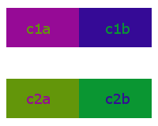
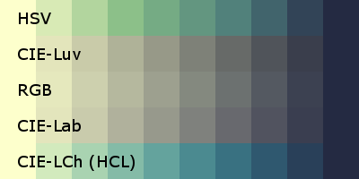
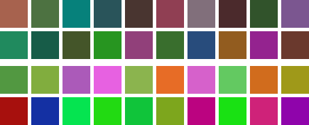
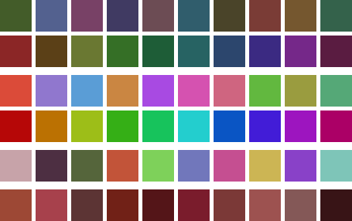
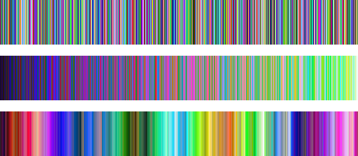

# @tsports/go-colorful

A TypeScript port of the Go colorful library for working with colors in various color spaces.

[](https://www.npmjs.com/package/@tsports/go-colorful)
[](https://www.typescriptlang.org/)
[](https://github.com/lucasb-eyer/go-colorful)

## Why?

This library is a faithful TypeScript port of the excellent [go-colorful](https://github.com/lucasb-eyer/go-colorful) library. It provides:

- **Complete API compatibility** with the original Go library
- **Multiple API styles**: Both TypeScript-idiomatic and Go-style APIs
- **Comprehensive color space support**: RGB, HSL, HSV, LAB, LUV, HCL, XYZ, OkLab, OkLch, HSLuv, HPLuv
- **Perceptually uniform color operations**: Distance calculations, blending, and palette generation
- **Type safety**: Full TypeScript definitions with proper typing

## What?

Go-Colorful (and this TypeScript port) stores colors in RGB and provides methods for converting to various color spaces. Currently supported colorspaces are:

- **RGB:** All three of Red, Green and Blue in [0..1]
- **HSL:** Hue in [0..360], Saturation and Luminance in [0..1] (legacy; prefer HCL)
- **HSV:** Hue in [0..360], Saturation and Value in [0..1] (prefer HCL)
- **Hex RGB:** The "internet" color format, as in #FF00FF
- **Linear RGB:** See [gamma correct rendering](http://www.sjbrown.co.uk/2004/05/14/gamma-correct-rendering/)
- **CIE-XYZ:** CIE's standard color space, almost in [0..1]
- **CIE-xyY:** encodes chromacity in x and y and luminance in Y, all in [0..1]
- **CIE-L\*a\*b\*:** A *perceptually uniform* color space. L\* in [0..1] and a\*, b\* almost in [-1..1]
- **CIE-L\*u\*v\*:** Very similar to CIE-L\*a\*b\*
- **CIE-L\*C\*h° (HCL):** Generally the [most useful](http://vis4.net/blog/posts/avoid-equidistant-hsv-colors/); CIE-L\*a\*b\* in polar coordinates
- **CIE LCh(uv):** Cylindrical transformation of the CIE-L\*u\*v\* color space
- **OkLab:** Modern perceptually uniform color space
- **OkLch:** Cylindrical OkLab (recommended for modern applications)
- **HSLuv:** The better alternative to HSL, see [hsluv.org](https://www.hsluv.org/)
- **HPLuv:** A variant of HSLuv for pastel colors

For colorspaces where it makes sense (XYZ, Lab, Luv, HCl), [D65](http://en.wikipedia.org/wiki/Illuminant_D65) is used as reference white by default, but methods for using custom reference whites are provided.

## Installation

```bash
npm install @tsports/go-colorful
# or
bun add @tsports/go-colorful
```

## Usage

### Two API Styles

This library provides **two API styles**:

1. **TypeScript Style** (default): Idiomatic TypeScript with camelCase methods
2. **Go Style**: Matches the original Go API exactly with PascalCase methods

```typescript
// TypeScript style (recommended for TS projects)
import { Color, Hex } from '@tsports/go-colorful';

const color = Hex('#FF0000');
const [h, s, l] = color.hsl();
console.log(color.hex()); // #ff0000

// Go style (for direct Go compatibility)
import * as GoStyle from '@tsports/go-colorful/go-style';

const color = GoStyle.Hex('#FF0000');
const [h, s, l] = color.Hsl();
console.log(color.Hex()); // #FF0000
```

### Basic Usage

Create colors using different source spaces:

```typescript
import { Color, Hex, Hsv, Xyz, Lab, Hcl } from '@tsports/go-colorful';

// All of the following create the same blue color
const c1 = new Color(0.313725, 0.478431, 0.721569);
const c2 = Hex("#517AB8");
const c3 = Hsv(216.0, 0.56, 0.722);
const c4 = Xyz(0.189165, 0.190837, 0.480248);
const c5 = Lab(0.507850, 0.040585, -0.370945);
const c6 = Hcl(276.2440, 0.373160, 0.507849);

console.log(`RGB values: ${c1.r}, ${c1.g}, ${c1.b}`);
```

Convert colors between different color spaces:

```typescript
const color = Hex("#517AB8");

const hex = color.hex();
const [h, s, v] = color.hsv();
const [x, y, z] = color.xyz();
const [l, a, b] = color.lab();
const [hcl_h, hcl_c, hcl_l] = color.hcl();
```

### Comparing Colors

In RGB space, Euclidean distance doesn't correspond to visual/perceptual distance. Use CIE color spaces for meaningful comparisons:



```typescript
import { Color } from '@tsports/go-colorful';

const c1a = new Color(150.0 / 255.0, 10.0 / 255.0, 150.0 / 255.0);
const c1b = new Color(53.0 / 255.0, 10.0 / 255.0, 150.0 / 255.0);
const c2a = new Color(10.0 / 255.0, 150.0 / 255.0, 50.0 / 255.0);
const c2b = new Color(99.9 / 255.0, 150.0 / 255.0, 10.0 / 255.0);

console.log(`DistanceRgb:       c1: ${c1a.distanceRgb(c1b)}\tc2: ${c2a.distanceRgb(c2b)}`);
console.log(`DistanceLab:       c1: ${c1a.distanceLab(c1b)}\tc2: ${c2a.distanceLab(c2b)}`);
console.log(`DistanceCIEDE2000: c1: ${c1a.distanceCIEDE2000(c1b)}\tc2: ${c2a.distanceCIEDE2000(c2b)}`);
```

**Output:**
```
DistanceRgb:       c1: 0.3804    c2: 0.3859
DistanceLab:       c1: 0.3205    c2: 0.2440
DistanceCIEDE2000: c1: 0.1727    c2: 0.1067
```

The CIE distances correctly show that the bottom two colors are more similar than the top two.

### Blending Colors

Different color spaces produce different blending results:



```typescript
import { Hex } from '@tsports/go-colorful';

const c1 = Hex("#fdffcc");
const c2 = Hex("#242a42");

// Blend in different color spaces
const rgbBlend = c1.blendRgb(c2, 0.5);
const hsvBlend = c1.blendHsv(c2, 0.5);
const labBlend = c1.blendLab(c2, 0.5);
const hclBlend = c1.blendHcl(c2, 0.5);

console.log(`RGB: ${rgbBlend.hex()}`);
console.log(`HSV: ${hsvBlend.hex()}`);
console.log(`LAB: ${labBlend.hex()}`);
console.log(`HCL: ${hclBlend.hex()}`);
```

**Note:** When blending in CIE color spaces, you might get invalid RGB colors. Use `.clamped()` to fix:

```typescript
const problematicBlend = c1.blendHcl(c2, 0.5);
if (!problematicBlend.isValid()) {
    const fixed = problematicBlend.clamped();
    console.log(`Fixed color: ${fixed.hex()}`);
}
```

### Random Colors

Generate random colors with specific characteristics:

```typescript
import { WarmColor, HappyColor, FastWarmColor, FastHappyColor } from '@tsports/go-colorful';

// Warm colors (oranges, reds, yellows)
const warmColor = WarmColor();      // Uses CIE-L*C*h° (slower, more coherent)
const fastWarm = FastWarmColor();   // Uses HSV (faster, less coherent)

// Happy colors (bright, saturated)
const happyColor = HappyColor();    // Uses CIE-L*C*h° (slower, more coherent)  
const fastHappy = FastHappyColor(); // Uses HSV (faster, less coherent)

console.log(`Warm: ${warmColor.hex()}, Fast Warm: ${fastWarm.hex()}`);
console.log(`Happy: ${happyColor.hex()}, Fast Happy: ${fastHappy.hex()}`);
```



### Random Palettes

Generate distinguishable color palettes:

```typescript
import { WarmPalette, HappyPalette, SoftPalette, SoftPaletteEx } from '@tsports/go-colorful';

// Generate palettes with different characteristics
const [warmPalette, error1] = WarmPalette(5);
const [happyPalette, error2] = HappyPalette(5);
const [softPalette, error3] = SoftPalette(5);

if (!error1) {
    console.log('Warm palette:', warmPalette.map(c => c.hex()));
}

// Custom palette with constraints
function isBluish(l: number, a: number, b: number): boolean {
    const [h, c, L] = LabToHcl(l, a, b);
    return 200 < h && h < 280 && c > 0.3; // Blue hues with good chroma
}

const [customPalette, error4] = SoftPaletteEx(5, {
    CheckColor: isBluish,
    Iterations: 50,
    ManySamples: true
});

if (!error4) {
    console.log('Custom blue palette:', customPalette.map(c => c.hex()));
}
```



### Sorting Colors

Sort colors to minimize perceptual jumps:

```typescript
import { Sorted } from '@tsports/go-colorful';

// Generate some random colors
const randomColors = Array.from({ length: 10 }, () => 
    new Color(Math.random(), Math.random(), Math.random())
);

// Sort them for smooth transitions
const sortedColors = Sorted(randomColors);

console.log('Random:', randomColors.map(c => c.hex()));
console.log('Sorted:', sortedColors.map(c => c.hex()));
```



### Gradient Generation

Create smooth color gradients:

```typescript
import { Hex } from '@tsports/go-colorful';

interface GradientKeypoint {
    color: Color;
    position: number; // 0.0 to 1.0
}

const keypoints: GradientKeypoint[] = [
    { color: Hex("#9e0142"), position: 0.0 },
    { color: Hex("#ffffbf"), position: 0.5 },
    { color: Hex("#5e4fa2"), position: 1.0 }
];

function getGradientColor(keypoints: GradientKeypoint[], t: number): Color {
    for (let i = 0; i < keypoints.length - 1; i++) {
        const c1 = keypoints[i];
        const c2 = keypoints[i + 1];
        
        if (c1.position <= t && t <= c2.position) {
            const localT = (t - c1.position) / (c2.position - c1.position);
            return c1.color.blendHcl(c2.color, localT).clamped();
        }
    }
    return keypoints[keypoints.length - 1].color;
}

// Generate gradient steps
const steps = 10;
for (let i = 0; i < steps; i++) {
    const t = i / (steps - 1);
    const color = getGradientColor(keypoints, t);
    console.log(`${(t * 100).toFixed(1)}%: ${color.hex()}`);
}
```


### Database Integration

The `HexColor` type provides database and JSON serialization:

```typescript
import { HexColor } from '@tsports/go-colorful';

const hexColor = new HexColor(new Color(1, 0, 0.5));

// Database operations
hexColor.scan('#FF0080');  // From database string
const dbValue = hexColor.value();  // To database string

// JSON operations  
const jsonString = hexColor.marshalJSON();  // To JSON
hexColor.unmarshalJSON('"#00FF00"');  // From JSON

console.log(`Color: ${hexColor.hex()}`);  // #ff0080
```

### Advanced Color Spaces

Work with modern color spaces:

```typescript
import { OkLab, OkLch, HSLuv, HPLuv } from '@tsports/go-colorful';

// OkLab - modern perceptually uniform space
const oklab = OkLab(0.7, 0.1, 0.05);
console.log(`OkLab color: ${oklab.hex()}`);

// OkLch - cylindrical OkLab (recommended)
const oklch = OkLch(0.7, 0.15, 180);
console.log(`OkLch color: ${oklch.hex()}`);

// HSLuv - better alternative to HSL
const hsluv = HSLuv(180, 100, 70);
console.log(`HSLuv color: ${hsluv.hex()}`);

// HPLuv - pastel variant of HSLuv  
const hpluv = HPLuv(180, 100, 70);
console.log(`HPLuv color: ${hpluv.hex()}`);
```

## API Reference

See the [API Documentation](api/README.md) for complete method documentation.

### Key Classes

- **Color**: Main color class with conversion and manipulation methods
- **HexColor**: Database/JSON serializable hex color

### Constructor Functions

- `Hex(hex: string)` - From hex string
- `Hsv(h, s, v)` - From HSV values  
- `Hsl(h, s, l)` - From HSL values
- `Lab(l, a, b)` - From CIE L\*a\*b\* values
- `Hcl(h, c, l)` - From CIE L\*C\*h° values
- `OkLab(l, a, b)` - From OkLab values
- `OkLch(l, c, h)` - From OkLch values
- `HSLuv(h, s, l)` - From HSLuv values

### Palette Functions

- `WarmPalette(count)` - Warm color palette
- `HappyPalette(count)` - Happy color palette  
- `SoftPalette(count)` - Soft color palette
- `SoftPaletteEx(count, settings)` - Custom constrained palette

### Utility Functions

- `Sorted(colors)` - Sort colors for smooth transitions

## Examples

See the [examples](examples/) directory for runnable TypeScript examples:

- [`colordist.ts`](examples/colordist.ts) - Color distance comparison
- [`colorblend.ts`](examples/colorblend.ts) - Color blending in different spaces
- [`colorgens.ts`](examples/colorgens.ts) - Random color generation
- [`palettegens.ts`](examples/palettegens.ts) - Palette generation
- [`colorsort.ts`](examples/colorsort.ts) - Color sorting
- [`gradientgen.ts`](examples/gradientgen.ts) - Gradient generation

Run examples with:
```bash
bun run docs/examples/colordist.ts
```

## Which Color Space Should I Use?

- **RGB** fits how *screens produce* color
- **CIE L\*a\*b\*** fits how *humans perceive* color  
- **HCL** fits how *humans think* about color

**Recommendation:** Use **HCL** instead of HSV for intuitive color manipulation. For fixed lightness and chroma, the hue angle rotates through colors of the same perceived brightness and intensity.

For modern applications, consider **OkLch** which provides better perceptual uniformity than HCL.

## Compatibility

- **Node.js**: ≥18.0.0
- **TypeScript**: ≥4.5.0  
- **Go Compatibility**: 100% API compatible with go-colorful v1.0.7

## License

MIT License - see [LICENSE](../LICENSE) for details.

## Credits

This is a TypeScript port of the excellent [go-colorful](https://github.com/lucasb-eyer/go-colorful) library by Lucas Beyer and contributors.

Original Go library credits:
- Lucas Beyer (original author)
- Bastien Dejean (@baskerville)
- Phil Kulak (@pkulak) 
- Christian Muehlhaeuser (@muesli)
- Scott Pakin (@spakin)
- makeworld (@makeworld-the-better-one) (current maintainer)

TypeScript port by TSports team.